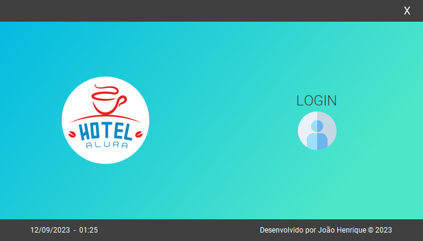
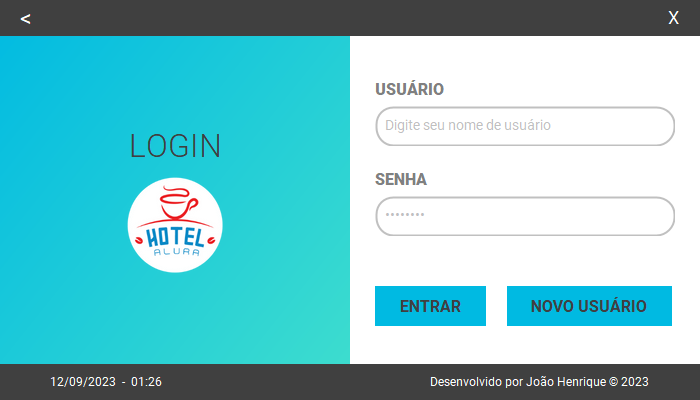
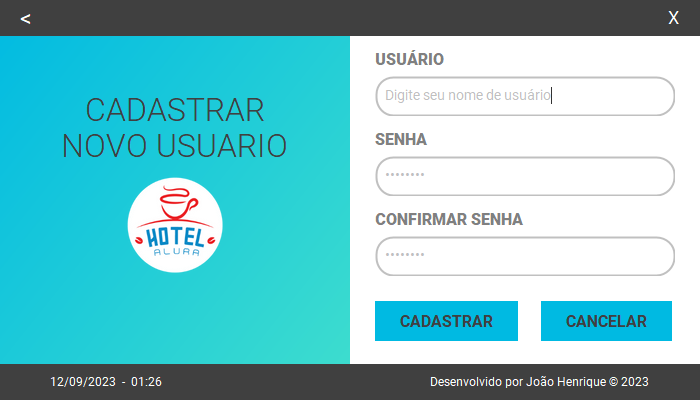
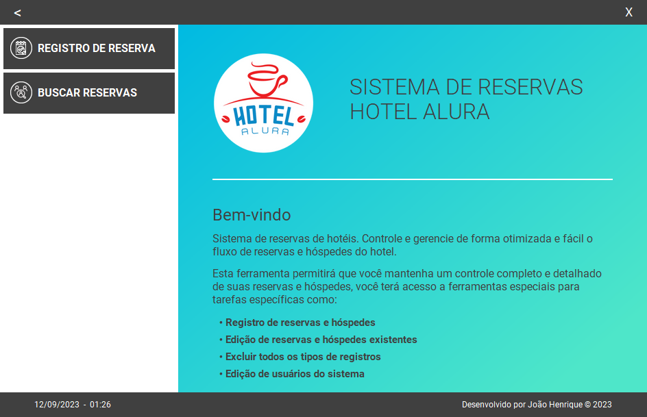
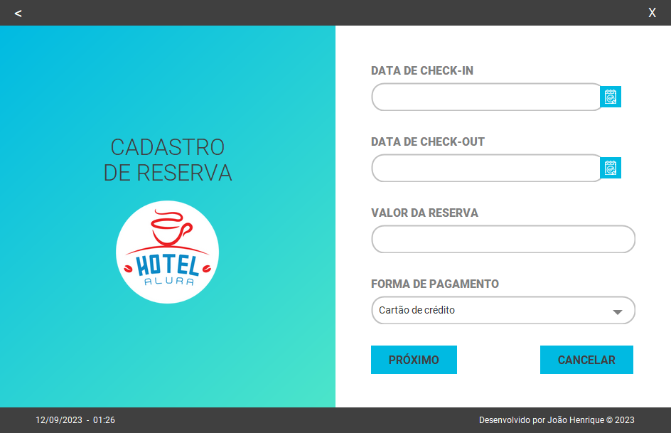
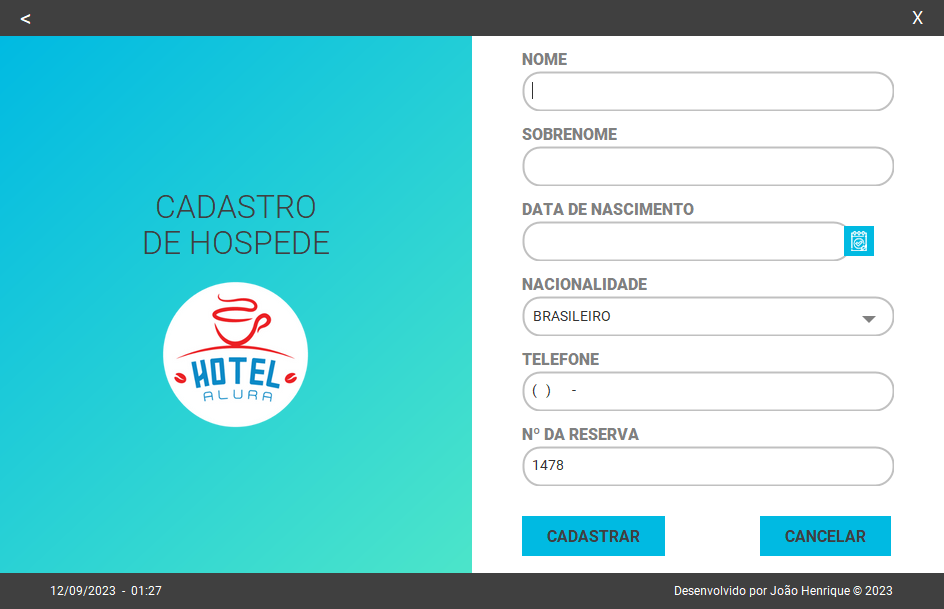
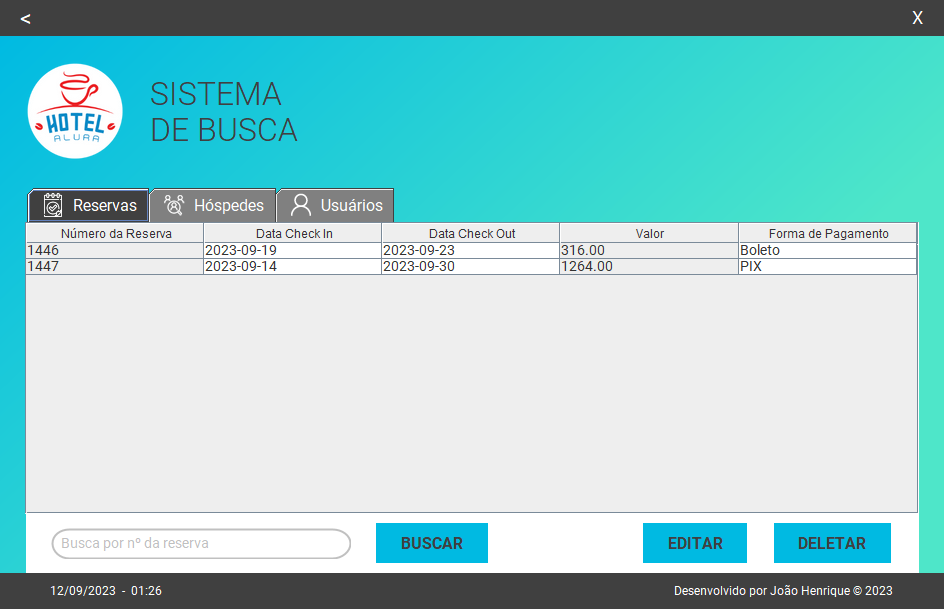

# ONE - Oracle Next Education - Challenge ONE - Hotel Alura - Alura

Repositório do desafio proposto pela ONE (Oracle Next Education) | Alura de desenvolver um sistema de gerencimaneto de reservas e hóspedes de um hotel.  

***

## O Desafio

Para o desafio, os seguintes requsitos foram estipulados.

1. Sistema de autenticação de usuários para que somente usuários pertencentes ao hotel possam acessar o sistema;

2. Permitir criar, editar e excluir uma reserva para clientes;

3. Pesquisar na base de dados toda a informação de clientes e reservas;

4. Registrar, editar e excluir os dados dos hóspedes;

5. Calcule o valor da reserva com base no número de dias da reserva e uma taxa diária com o valor atribuído por você na moeda Real. Por exemplo, se tivermos uma reserva de 3 dias e o valor de nossa diária for de R$20 devemos multiplicar esses 3 dias pelo valor da diária, totalizando R$60. Tudo isso deve ser feito automaticamente e mostrado ao usuário antes de salvar a reserva;

6. Banco de dados para armazenar todos os dados solicitados anteriormente.

## Desenvolvimento

Para auxiliar no desenvolvimento, foi disponibilizado a parte gráfica do sistema para só focar na parte lógica do desafio.  
[Repositório - challenge-one-alura-hotel-br](https://github.com/alura-challenges/challenge-one-alura-hotel-br)

Escolhi usar o H2 Database para esse desafio.

Com base na interface gráfica disponibilizada, desenvolvi uma nova inferface, aplicando alguns conceitos de OO para auxiliar na criação das novas telas.

## Funcionalidades

> * 1 - Tela inicial do sistema

> * 2 - Tela de login  
É possivel acessar o sistema utilizando o usuário "admin" e senha "admin".  

> * 3 - Tela de cadastro de novos usuários

> * 4 - Tela principal do sistema

> * 5 - Tela de cadastro reservas

> * 6 - Tela de cadastro de hóspedes

> * 7 - Tela de busca de todos os registros do sistema

***

